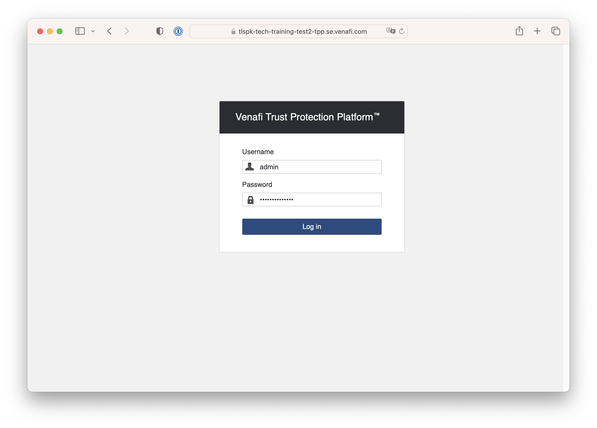
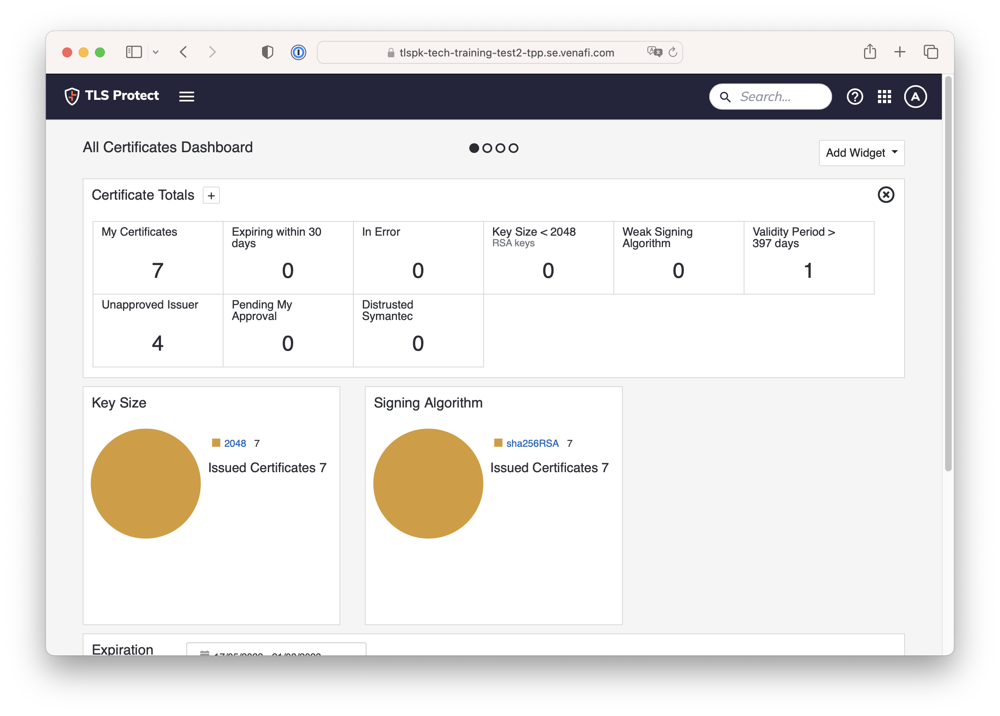

# 01. Access TLS Protect Data Center

You will need a TLS Protect Data Center instance. One will be allocated to you by the Workshop Team

To login the user name is `admin`. Ask the Workshop Team for the password

  

  

Next: [Main Menu](../../README.md) | [02. TLS Protect for Kubernetes](../02-tlspk/README.md)