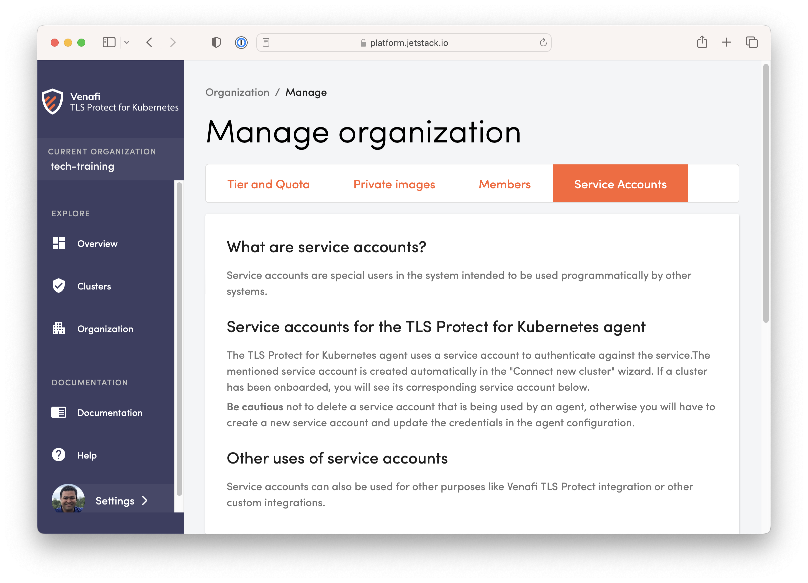

#  02. TLS Protect for Kubernetes

TLS Protect for Kubernetes is the control plane for Kubernetes clusters.

A service account is required for a kubernetes cluster to join the TLS Protect for Kubernetes Org. 

A service account is also required for TLS Protect Data Center to Discovery certificates. 

For this workshop a service account has been prepared for attendees. The workshop team will share at the time of the workshop.

If you are running this workshop against a TLS Protect for Kubernetes Org of yours then make sure to create a service account 

  

Next: [Main Menu](../../README.md) | [03. Build a Kubernetes Cluster](../03-k8scluster/README.md)