# 03. Build a Kubernetes cluster

You need a kubernetes cluster for the workshop. An AWS cloudformation template has been prepared for you to use.

Go to Okta and click on the AWS tile to login to your AWS account

  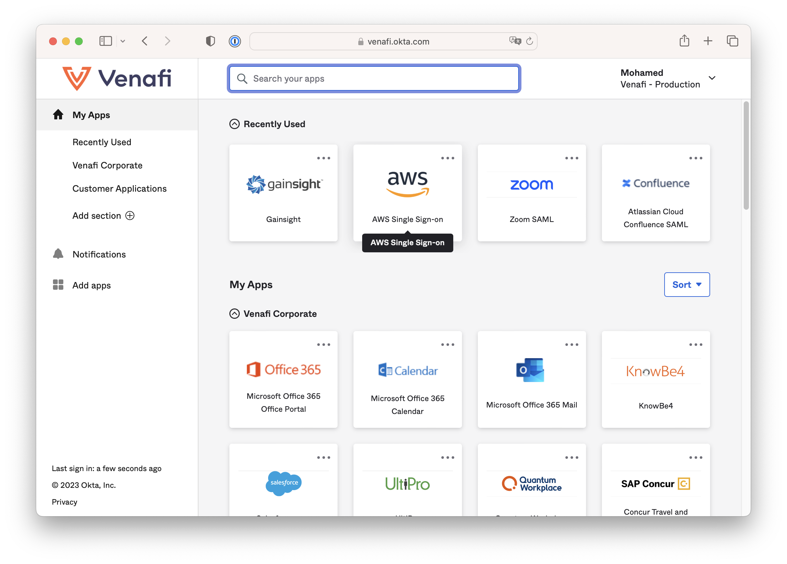

Go to the AWS Management Console. 

  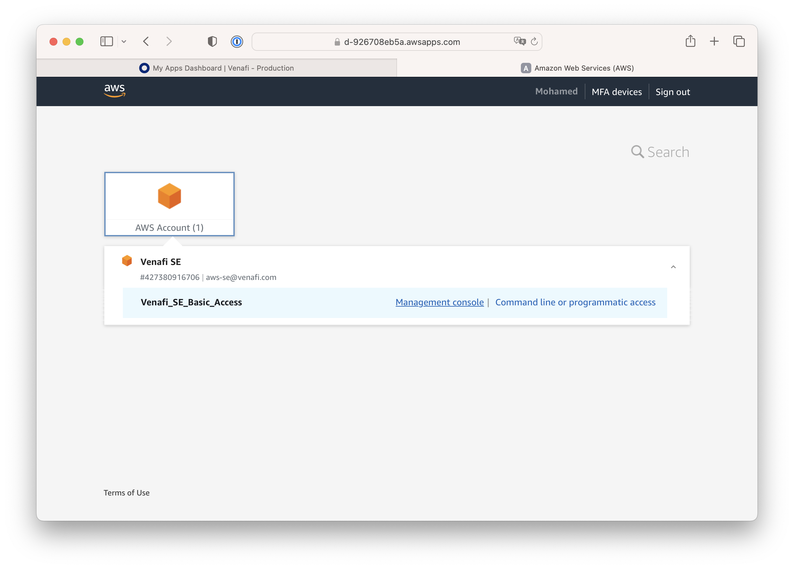

Select US East (N. Virgina) `us-east-1` as the AWS region

  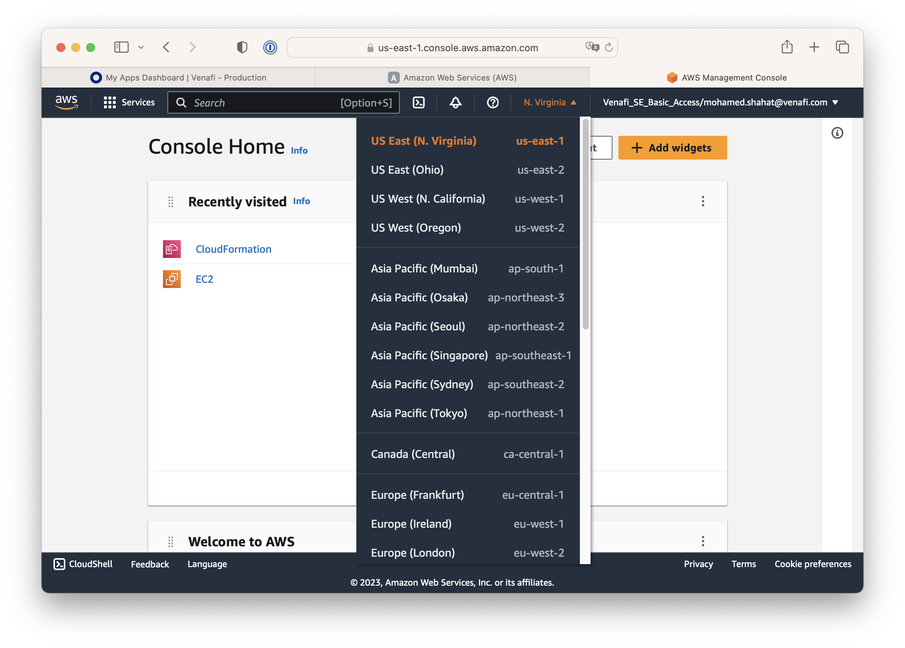

Go to CloudFormation service. You can search for it

  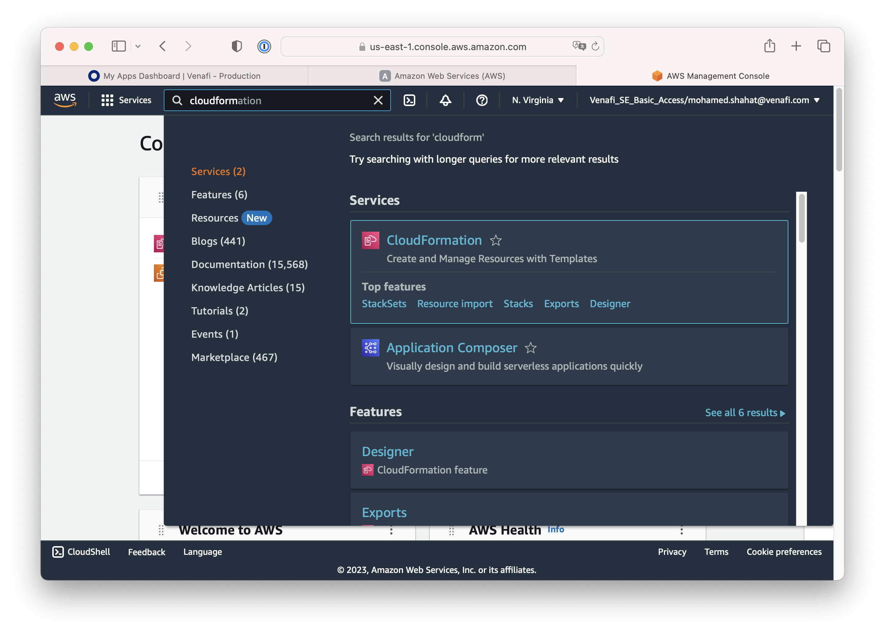

Once you're in the CloudFormation Service console. Click on Create Stack > With New Resources (Standard)

  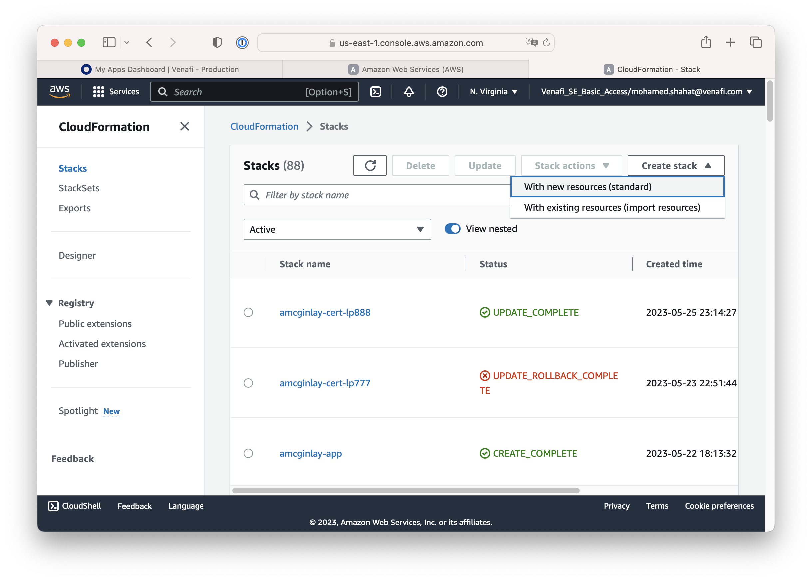

In the Specify template section. Use this URL where we've staged the CloudFormation template for you, then click Next

`https://venafi-ecosystem.s3.amazonaws.com/tlspk/v1/cfn-tlspk-cluster-bootstrapper.yaml`

  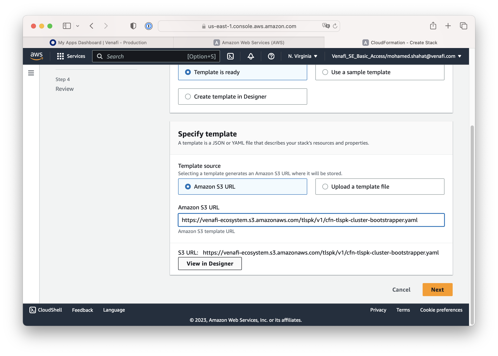

In the Specify stack details screen. enter the Stack name. 
Recommendation is to use your AD username + k8s-cluster.

  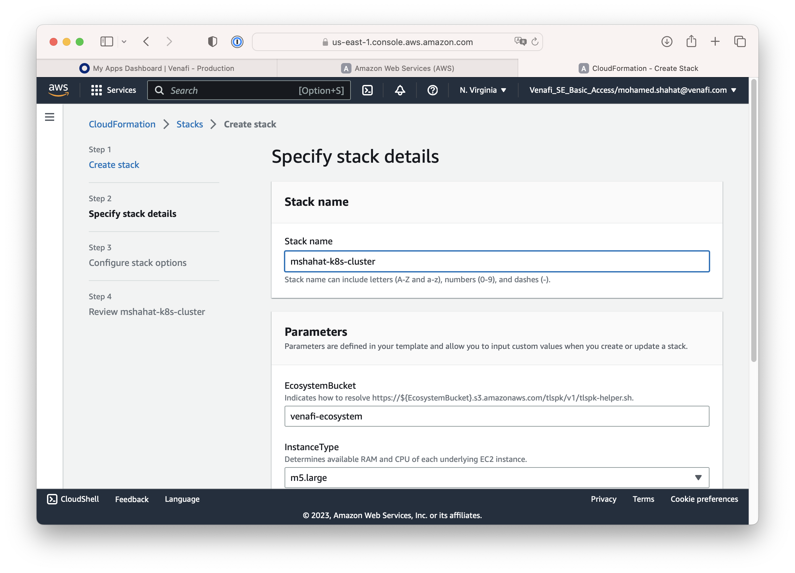

The CloudFormation template will create a kubernetes clusters and will have it join the TLS Protect for Kubernetes Org. For that, you will need to provide the service account details `TLSPKSAUserId` and `TLSPKSAUserSecret`

For the Workshop, please ask the Workshop team for the TLS Protect for Kubernetes service account UserId and Secret. We've prepared one for the workshop.

If you're running this as a demo using your own TLS Protect for Kubernetes Org, then you will need to Create a Service Account to use

  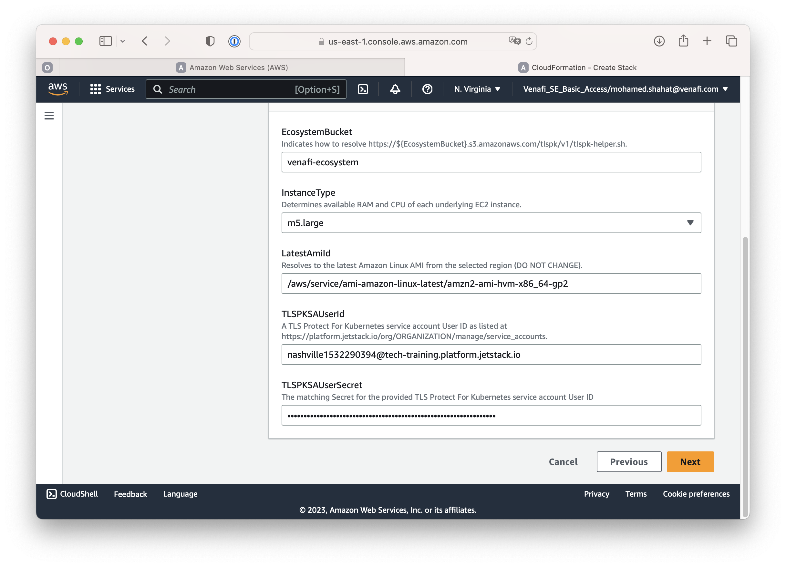

If you see errors, that is most probably as your AWS account does not have access to particular services. It's safe to ignore these errors for the purpose of this workshop, click Next

  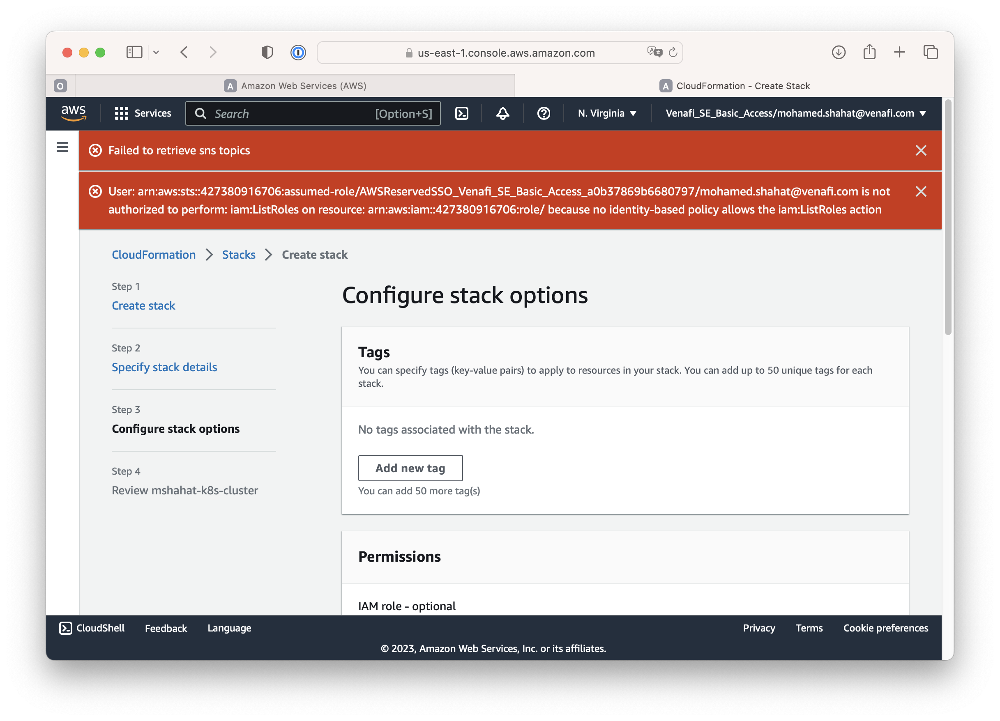

Review the stack details to make sure all configured as you'd expect then click Submit

  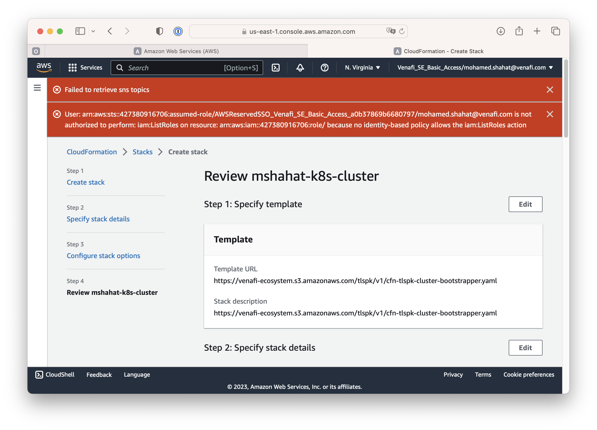

  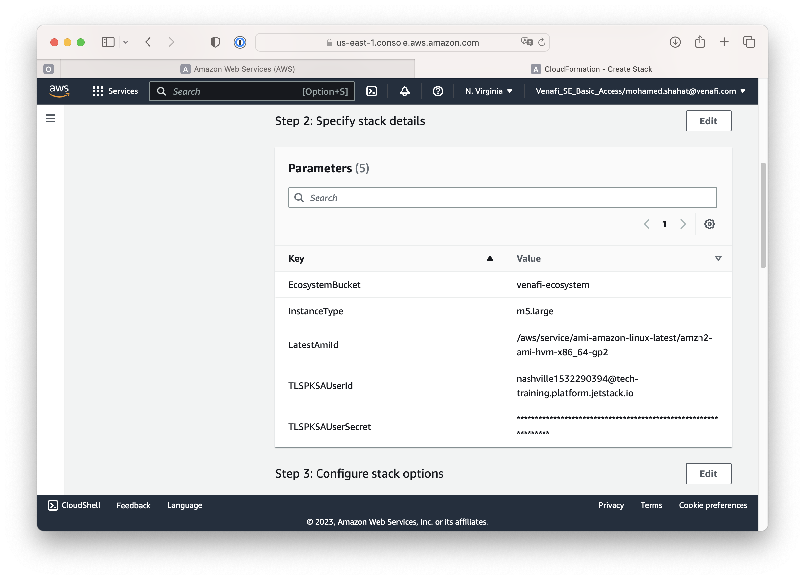

  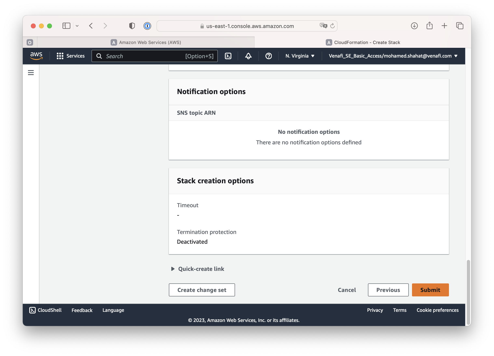

Monitor this page for updates on the stack progress until it shows `CREATE_COMPLETE`

  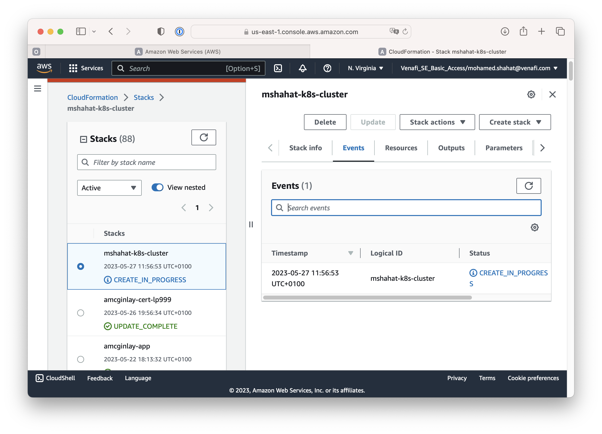

  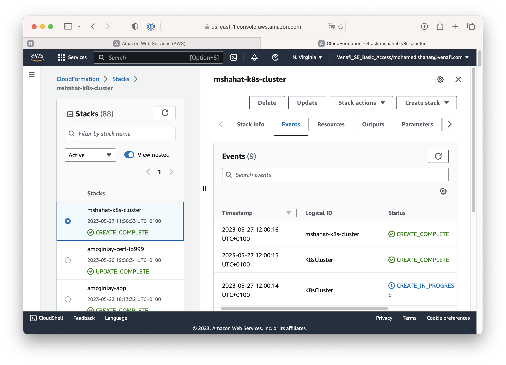

Next: [Main Menu](../../README.md) | [04. Create a Policy folder](../03-k8scluster/README.md)