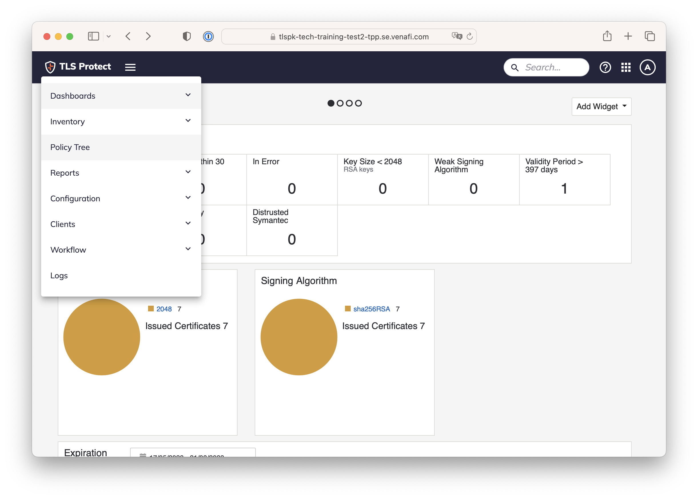
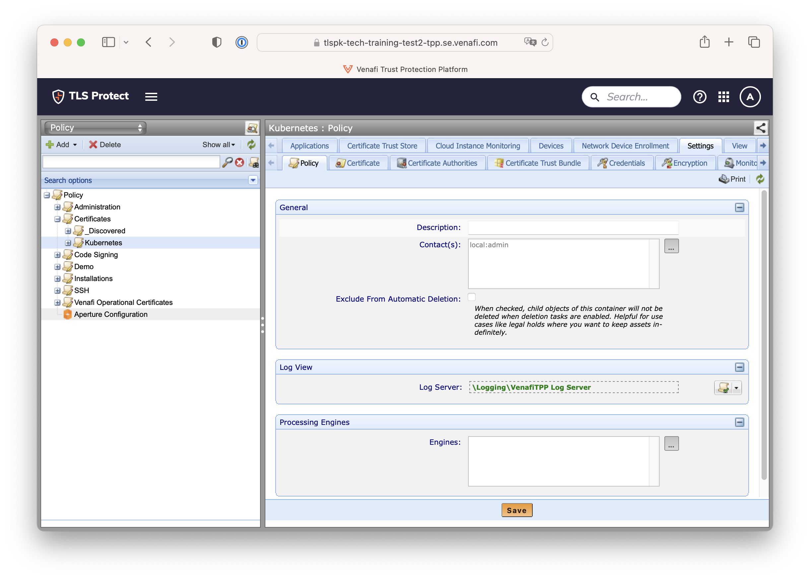

# 04. Create a Policy folder

A policy folder needs to be created to host the discovered Kubernetes Clusters and Certificates

Click on the Menu > Policy Tree

  

Create a folder `Certificates\\Kubernetes`

  

Next: [Main Menu](../../README.md) | [05. Configure and Run TLSP DC Kubernetes Discovery Job](../05-k8sdiscovery/README.md)