# 05. Configure and Run TLSP DC Kubernetes Discovery Job

Now you have all the key parts to be able to run a Kubernetes Discovery Job. Kubernetes Discovery Job is available starting version 22.4 of TLS Protect Data Center

Login to TLS Protect Data Center and go to Menu > Configuration > Jobs

  

Click on Create New Job

  

Choose Kubernetes Discovery

  

Now it's time to configure the Kubernetes Discovery Job

Name – a describtive name 

Then for Authentication click on Create New Credential. or Select from the drop down menu if there is an existing one created

  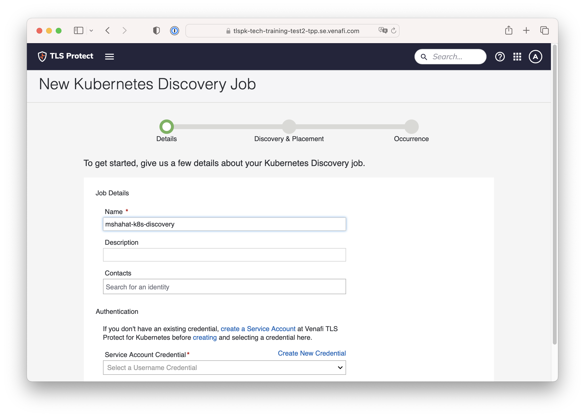

In the Create New User Credential menu, choose the folder to store the credentails you are doing to creat. For the workshop you could use the Policy folder you have created earlier. 
`Policy \\ Certificates \\ Kuberentes`

  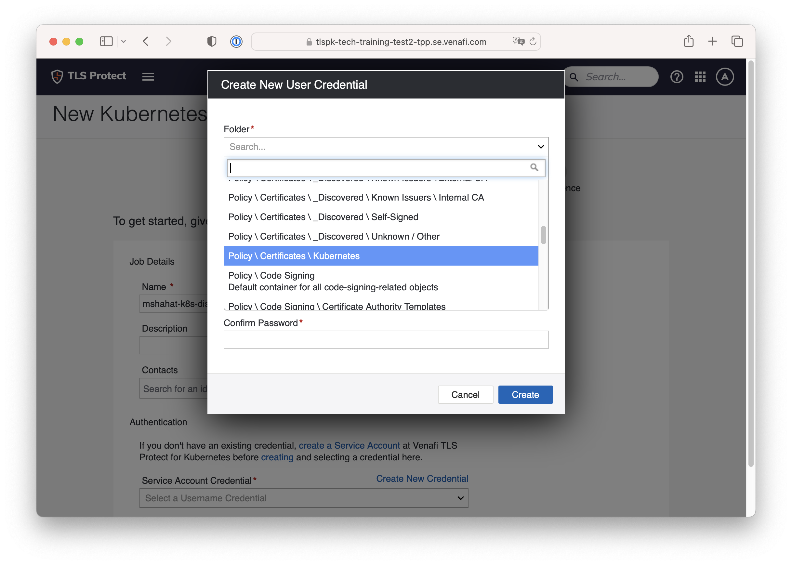

Complete the Credential name. Then complete the User Name and Password. These are the values from the TLSPK service account. Then click Create

  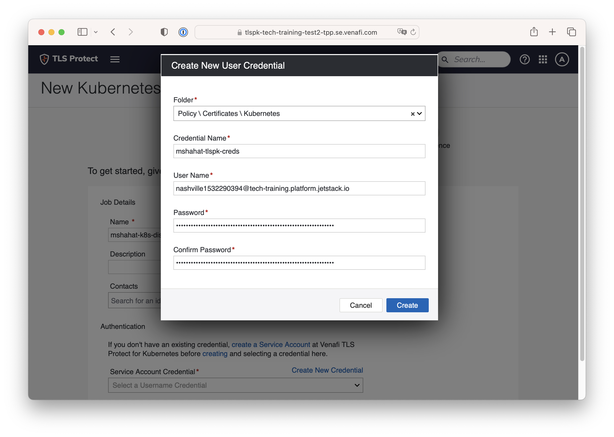

This is how it looks after the Service account credential is created. Click Next

  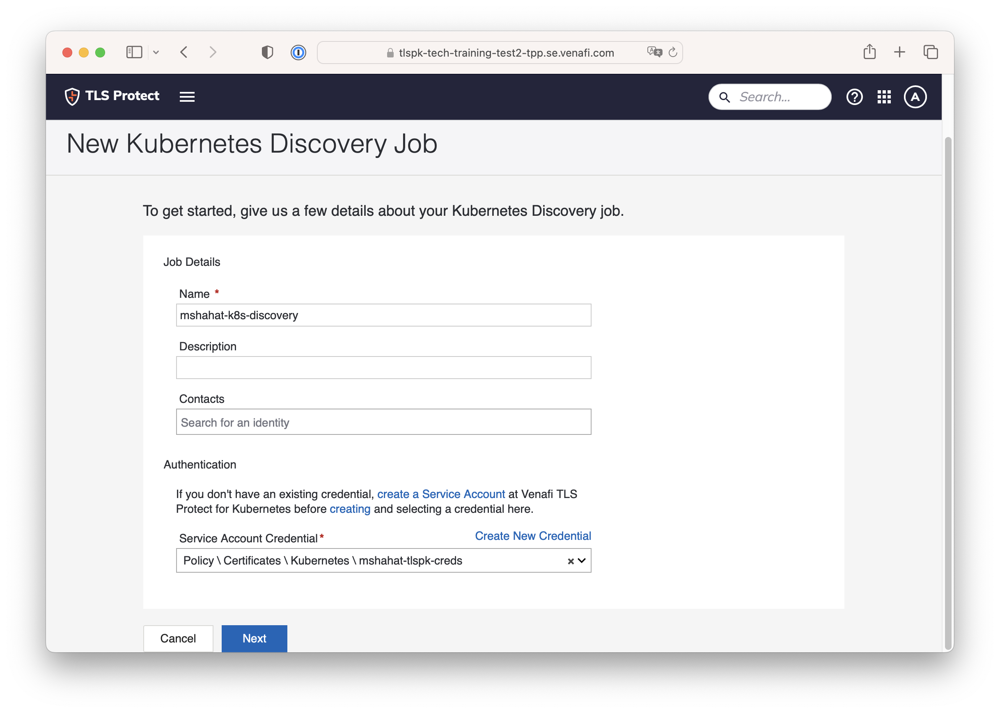

In the Discovery and Placement section, you could either choose all clusters in the TLSPK Organistion or select particular clusters.

  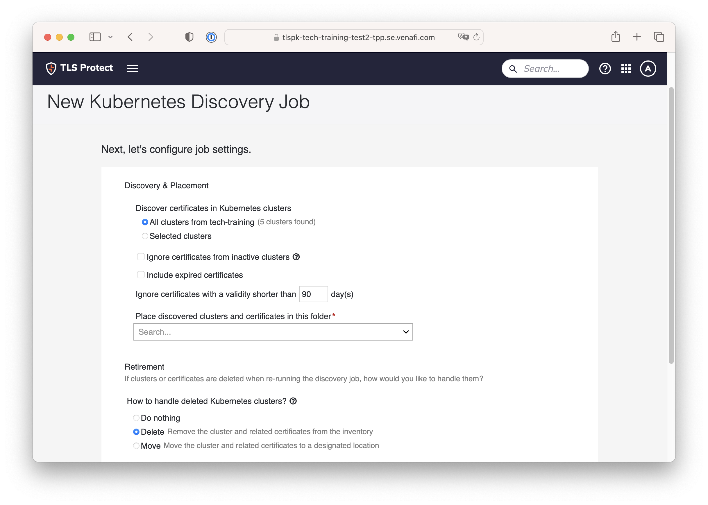

For this workshop and as the TLSPK Org is expected to have many kubernetes clusters, please choose Selected Clusters and select your kubernetes cluster

  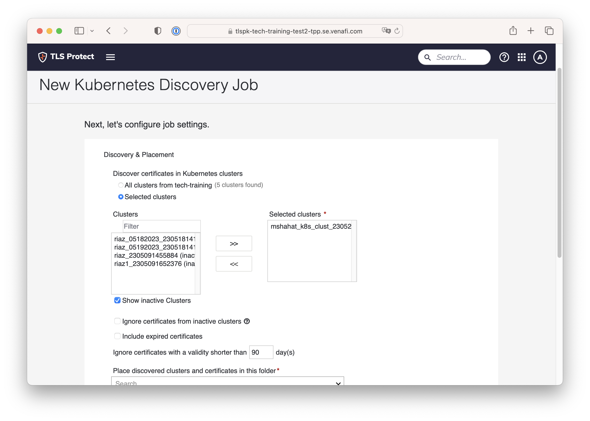

Choose which folder to place the discovered clusters and certificates. Remember the folder you created earlier.

  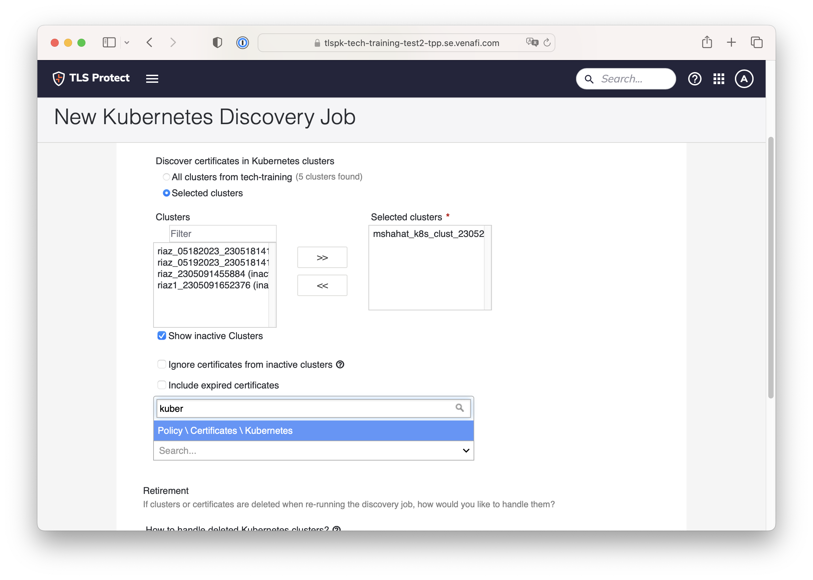

There are more configurations related to Retired kubernetes clusters and/or Certificates. Choose how you'd like to see these handled based on your scenario, then click Next

  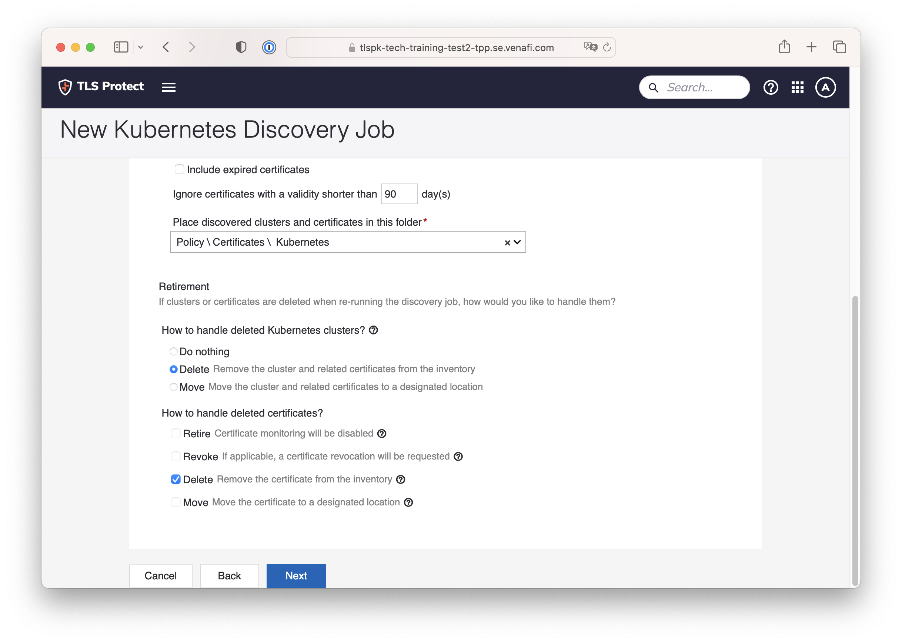

As expected the discovery job could be run based on an arbitrary frequency or Manually run. For the workshop, please choose Manually run then hit either Create Job or Create & Run

  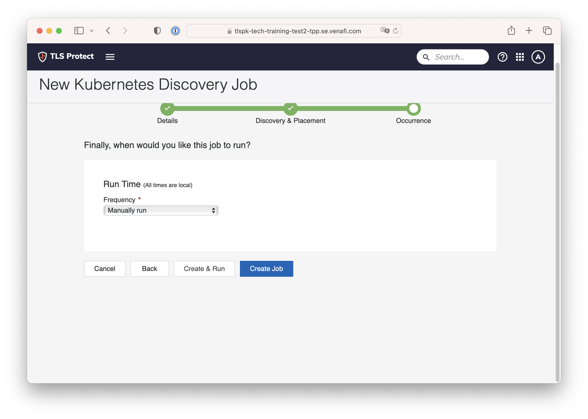

Once the Kubernetes discovery job is created. You can click on Run now if you've selected Create Job earlier.

  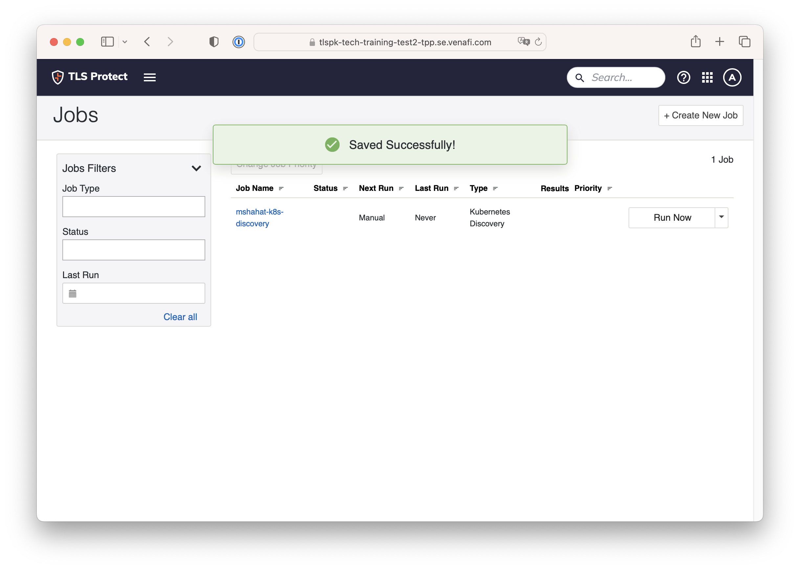

Now you can see that the Job is completed. Notice the Results column.

  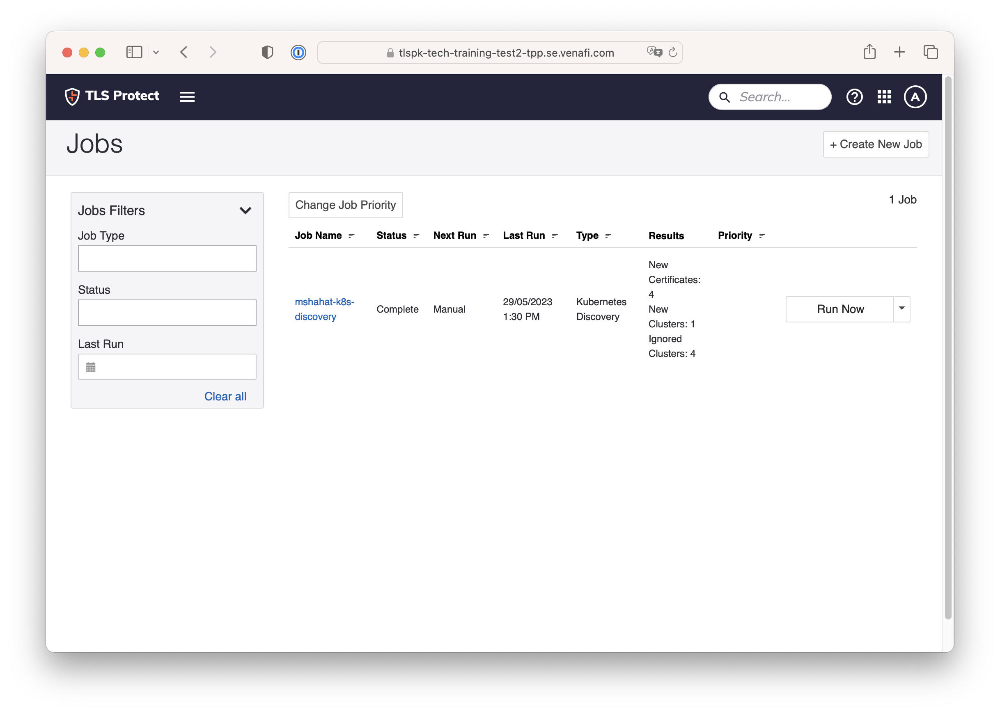

Go to Policy Tree and browse the `Certificates \\ Kubernetes` folder and observe the discovered org, kubernetes clusters, kubernetes clusters namespaces and the associated certificates

  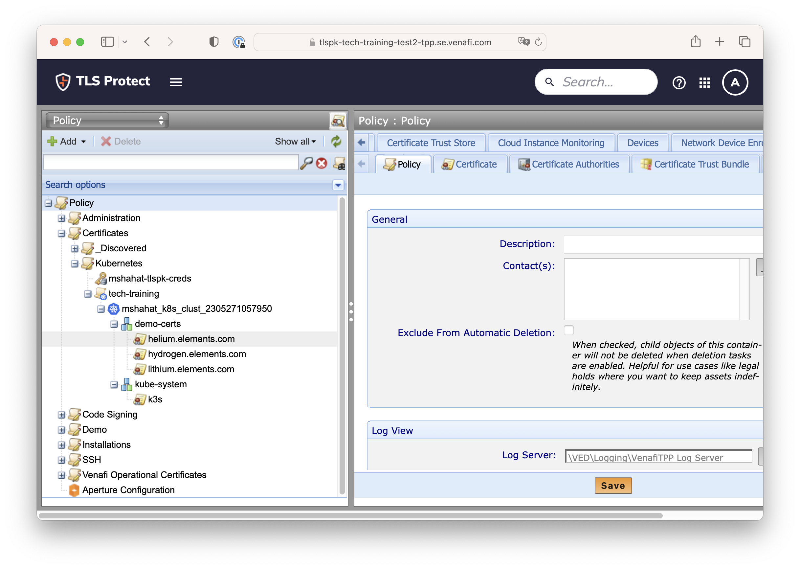

Next: [Main Menu](../../README.md)