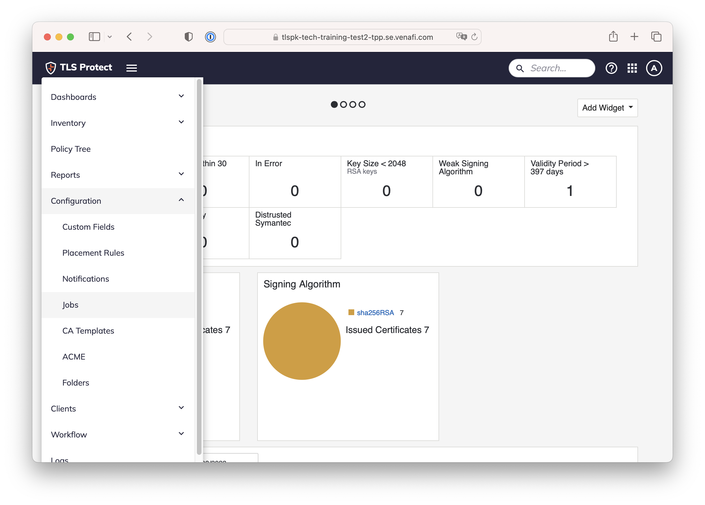
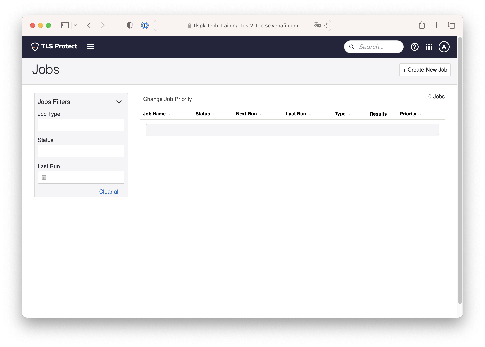
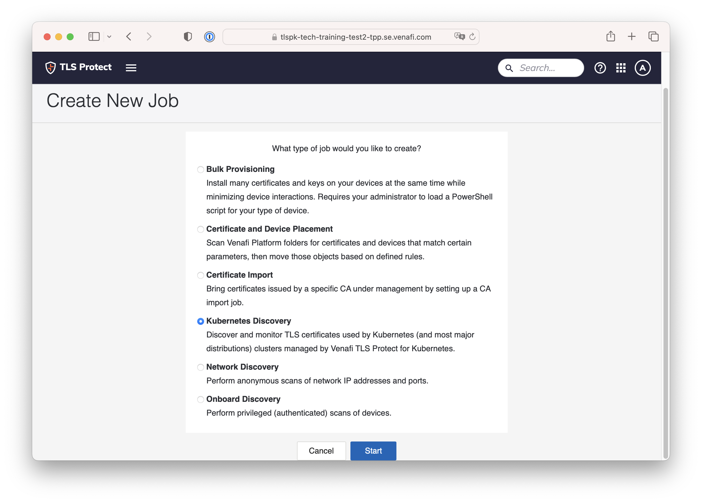
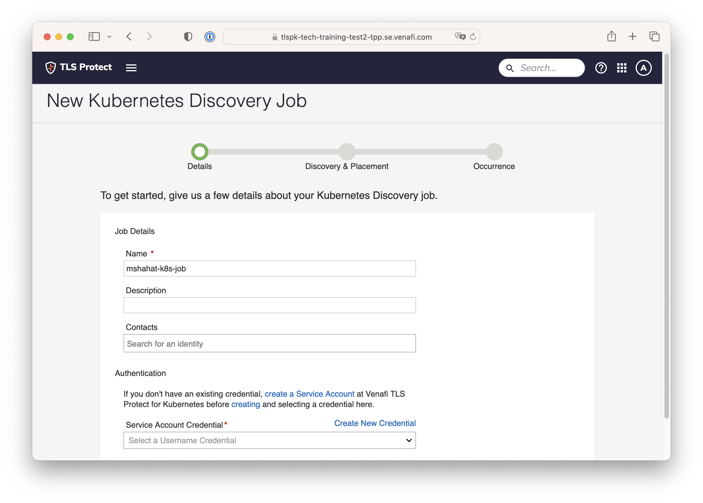

# 05. Configure and Run TLSP DC Kubernetes Discovery Job

Now you have all the key parts to be able to run a Kubernetes Discovery Job. Kubernetes Discovery Job is available starting version 22.4 of TLS Protect Data Center

Login to TLS Protect Data Center and go to Menu > Configuration > Jobs

  

Click on Create New Job

  

Choose Kubernetes Discovery

  

Now it's time to configure the Kubernetes Discovery Job

Name – a describtive name 

  

  

Next: [Main Menu](../../README.md) | [xxx]()